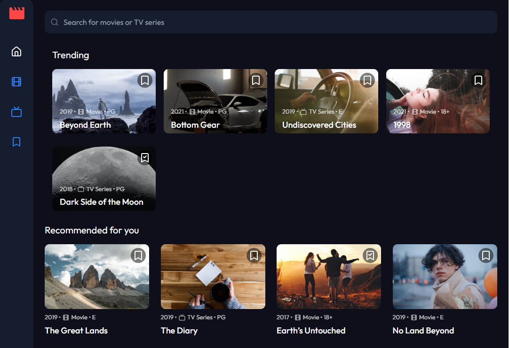

# 🎬 Entertainment Web App

A modern entertainment web application built with Next.js, React,
Tailwind CSS, and JavaScript. This project was developed as part of a
Frontend Mentor challenge and provides users with an interactive
platform to browse movies and TV series, search content, and manage
bookmarks.

## 📸 Screenshot



## 🚀 Features

- Browse movies and TV series
- Navigate between Home, Movies, TV Series, and Bookmarked pages
- Search across all available content
- Add and remove items from bookmarks
- Responsive design for all screen sizes
- Dynamic content rendering from data sources
- Interactive and user-friendly UI

## 🛠️ Technologies Used

- Next.js
- React.js
- JavaScript
- Tailwind CSS

## 📖 About The Project

This project is an entertainment web application developed as part of
a Frontend Mentor challenge, with the goal of recreating a modern and
interactive media browsing experience.

Users can explore a collection of movies and TV series, navigate
through different sections such as Home, Movies, TV Series, and
Bookmarked content, and search across the entire dataset. The
application also allows users to add or remove items from their
bookmarked list for quick access later.

The main focus of this project was to translate a UI design into a
fully functional and interactive web application while maintaining
responsiveness and smooth user experience across different devices.

This project demonstrates my ability to:

- Build multi-page frontend applications
- Manage application state effectively
- Handle dynamic content rendering
- Implement search and filtering functionality
- Create responsive and modern UI layouts
- Work with structured frontend architecture

## 🎯 User Flow

1. Browse content on the Home page.
2. Navigate between Movies and TV Series sections.
3. Search for specific content.
4. Bookmark or remove items from the saved list.
5. View bookmarked content in a dedicated page.

## ▶️ Installation & Setup

1. Clone the repository:

```bash id="2k8x9a"
git clone https://github.com/mehdias63/Entertainment-web-app.git
```

2. Navigate to the project directory:

```bash id="9p3q1d"
cd entertainment-web-app
```

3. Install dependencies:

```bash id="k4m7t2"
npm install
```

4. Run the development server:

```bash id="s8w1pl"
npm run dev
```

5. Open your browser and visit:

```text id="v6r9xq"
http://localhost:3000
```

## 🌐 Live Demo

[View Demo](https://entertainment-web-app-three-smoky.vercel.app/)

## 👨‍💻 Author

Developed by Mehdi Tatasadi
